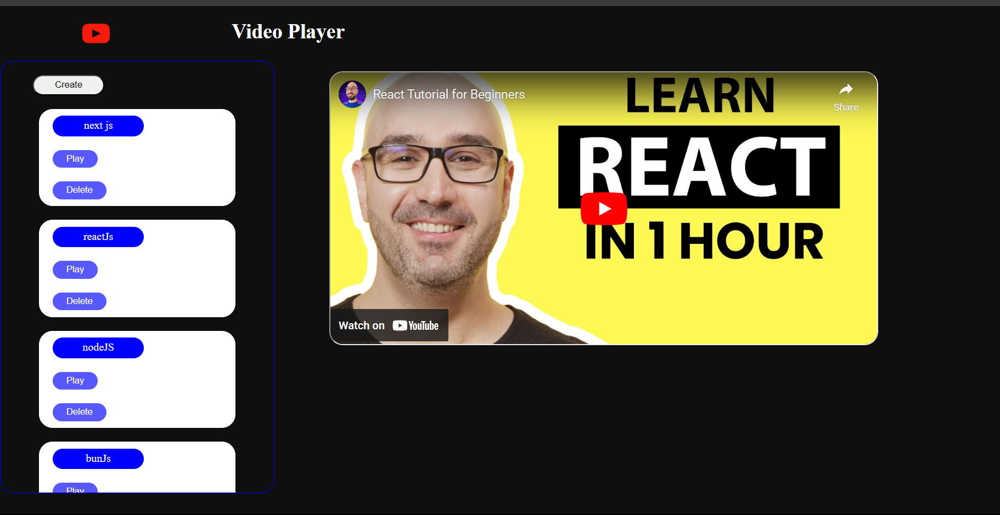

# Video Player App

The Video Player App is a React-based web application that allows users to watch YouTube videos by inputting their video links directly into the app.

## Table of Contents

- [Introduction](#introduction)
- [Features](#features)
- [Technologies Used](#technologies-used)
- [Installation](#installation)
- [Usage](#usage)
- [Contributing](#contributing)
- [License](#license)

## Introduction

The Video Player App is designed to provide a simple and user-friendly interface for watching YouTube videos without leaving the application. Users can input valid YouTube video URLs into the app, and the app will display and play the videos directly.

## Features

- Input field for adding YouTube video URLs.
- Video player to display and play the selected video.
- Play, pause, and volume control options.
- Responsive design for mobile and desktop viewing.

## Technologies Used

- React: A JavaScript library for building user interfaces.
- Axios: A promise-based HTTP client for making API requests.
- React Player: A React component for playing media from various sources, including YouTube.

## Installation

1. Clone the repository:

   ```bash
   https://github.com/Sviyas/videoPlayer.git
   ```



